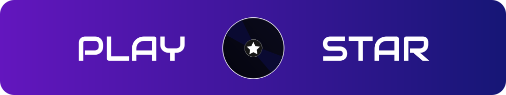
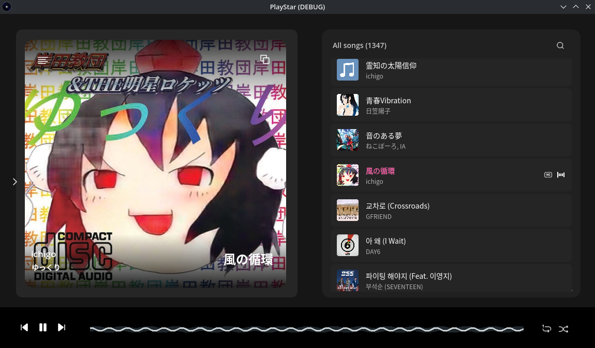

# PlayStar

[](./LICENSE)
[]()
[]()

PlayStar is a personal music player for Linux, built with Godot 4 and C# (.NET 8). It uses a local SQLite library, synchronized lyrics, MPRIS integration, and Discord Rich Presence.



---

## Features

**Currently available**

- Music playback via LibVLC
- Keyboard shortcuts
- MPRIS media controls (D-Bus)
- Discord Rich Presence
- Settings panel
- Album art display with lazy loading
- Shuffle and repeat modes
- Full library scanning with multi-folder support and progress tracking
- Synchronized lyrics (`.lrc`) with auto-scroll
- Genre, artist and album browsing

**Planned**

- Now Playing thumbnail generator with clipboard export

---

## Services

Synchronized lyrics are fetched from [LRCLIB](https://lrclib.net), a free and open lyrics database with no profit intention, built for FOSS music players.


## Requirements

- Linux x86_64
- [Godot 4.7](https://godotengine.org/) (to build from source)
- .NET 8 SDK
- VLC (`libvlc`) installed on the system
- `vlc-plugin-pipewire` recommended for PipeWire setups

> Windows is not officially supported. LibVLCSharp has known issues on Windows, and MPRIS is a Linux-only protocol. No support for Windows is planned at this time.

---

## Dependencies

PlayStar uses the following NuGet packages:

| Package | Version |
|---|---|
| Godot.NET.Sdk | 4.7.0 |
| DiscordRichPresence | 1.6.1.70 |
| LibVLCSharp | 3.10.0 |
| Microsoft.Data.Sqlite | 10.0.9 |
| SkiaSharp | 4.148.0 |
| TagLibSharp | 2.3.0 |
| Tmds.DBus | 0.94.2 |

Some of these packages carry their own licensing terms, separate from this project's BUSL-1.1 license. See [`THIRD_PARTY_LICENSES.txt`](./THIRD_PARTY_LICENSES.txt) for details — this applies in particular to **LibVLCSharp** (LGPL) and **TagLibSharp** (LGPL).

---

## Installation

Pre-built releases are available on the [Releases](../../releases) page as `.tar` archives for Linux x86_64. Each archive includes the necessary native DLLs.

Extract and run:

```sh
tar -xf playstar-<version>-linux-x86_64.tar
cd playstar
./PlayStar
```

> Releases are intended for **personal use only**, as defined by the BUSL-1.1 license. Commercial use is not permitted.

---

## Building from Source

```sh
git clone https://github.com/hayukimori/PlayStar.git
cd PlayStar
dotnet restore
```

Then open the project in Godot 4.7 and export or run from the editor.

---

## License

This project is licensed under the [Business Source License 1.1](./LICENSE).  
It is made available for personal use only. The license terms include restrictions on commercial use.

Third-party components are subject to their own licenses. See [`THIRD_PARTY_LICENSES.txt`](./THIRD_PARTY_LICENSES.txt) for the full list.
